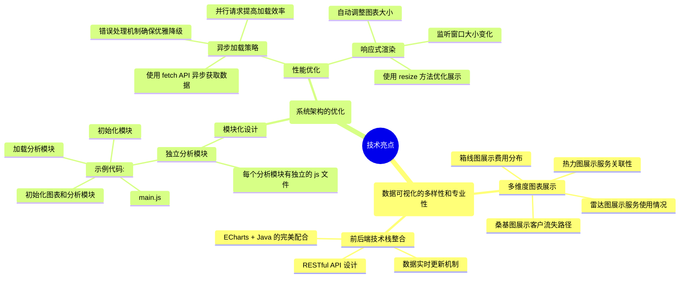

# a simple visualization job

## 01项目简介

**github链接：**[geyaokai/vis: 可视化](https://github.com/geyaokai/vis/tree/master)


这个项目是一个电信客户流失分析系统，主要针对电信运营商的客户数据进行深入分析。从展示的图表和代码来看，项目的主要需求包括以下几个方面：

1. 客户流失分析需求：

- 客户生命周期阶段的流失风险分析
- 不同合同类型的客户流失情况对比
- 客户流失路径追踪
- 流失预警机制的建立

2. 人口统计分析需求：

- 客户性别分布分析
- 年龄段与服务使用的关联分析
- 不同人群的消费能力分析
- 客户群体画像构建

3. 服务使用分析需求：

- 各项服务之间的关联性分析
- 服务订阅趋势追踪
- 服务与流失的关系分析
- 不同服务组合的效果评估

4. 财务相关分析需求：

- 月费用与总费用关系分析
- 不同合同类型的费用分布分析
- 高价值客户识别
- 收入贡献度分析

5. 技术实现需求：

- 数据可视化展示
- 实时数据更新
- 交互式分析界面
- 响应式设计适配

这个系统的主要目标是帮助运营商：

- 提前识别潜在的流失风险
- 了解客户流失的主要原因
- 制定针对性的客户维系策略
- 优化服务组合和定价策略
- 提升客户满意度和忠诚度

## 02. 技术简介


## 03. 项目展示

### 1.  客户流失分析

**整体效果展示：**


#### 1.1 客户生命周期分析


> 图像描述：
>
> 这是一个复合图表，包含柱状图和折线图。横轴表示客户生命周期阶段（从0-6月到5年以上），纵轴左侧是客户数量（从0到1500），右侧是百分比（0%到80%）以及月平均消费的金额（元）。图中绿色柱形表示新户客户，红色柱形表示流失客户，黄色折线表示全部客户比例，蓝色折线表示流失率。
>
> 数据分析：
>
> 从数据趋势可以看出几个重要信息：
>
> - 客户总数在初期（0-6月）和长期（5年以上）都较高，中间期间相对平稳；
>
> - 客户流失主要集中在早期阶段，特别是0-6月期间流失最为严重，随着时间推移流失率显著下降；
>
> - 客户总量（黄线）呈现稳步上升趋势，说明**整体客户群体消费在持续增长**；
>
> - **流失率（蓝线）呈现明显的下降趋势，表明客户忠诚度随着使用时间的增加而提升。**
>
> 这表明企业需要特别关注新客户的前6个月运营，这是防止客户流失的关键时期。


#### 1.2 不同合同类型的客户流失分析


> 图像描述：
>
> 这是一个堆叠柱状图，展示了不同合同类型（年付、月付、两年付）下的客户流失情况。横轴表示合同类型，纵轴表示客户数量（0-4000），每个柱子由两种颜色组成：红色代表已流失客户，绿色代表未流失客户。
>
> 数据分析：
>
> 从图表数据可以得出以下关键信息：
>
> - 月付用户群体最大，约有4000人左右，但其流失率也最高，红色部分占比明显；
>
> - 年付和两年付的用户规模相对较小，都在1500人左右，但其客户稳定性明显更好，绿色部分占比更大；
> - 两年付的客户流失情况最少，说明长期合同对维持客户忠诚度有积极作用。
>
> 这些数据表明，**公司应该考虑采取措施鼓励客户选择更长期的合同类型**，以降低整体流失率。

#### 1.3 客户流失路径分析


> 桑基图(Sankey Diagram)，展示了客户流失路径的分析。
>
> 图表从左到右显示了客户的转化流程，从所有客户开始，经过不同类型的筛选条件（如"合同类型月付"、"合同类型年付"等），最终分流到不同的结果状态（如"服务不满意"、"价格因素"等）。
>
> 这种可视化方式可以帮助理解客户流失的主要原因是服务不满意，流失的主要路径是月付客户。
>
> - 流失原因分类：
>
>   - 服务不满意：
>     - 没有在线安全服务
>     - 没有技术支持
>     - 没有在线备份服务
>   - 价格因素：
>     - 选择月付费合同
>     - 可能对价格较为敏感
>   - 竞争对手：
>     - 非两年期合同
>     - 使用基础DSL服务
>     - 没有使用流媒体服务
>
>   - 其他原因：
>     - 不属于上述任何类别的流失客户

#### 1.4 客户流失风险阶段分析


> 图像描述：
>
> 这是一个双漏斗图，展示了客户流失风险阶段分析。
>
> 左侧漏斗展示了从全部客户到实际流失的转化过程，右侧漏斗展示了具体的流失原因分布。
>
> 每个层级都用不同的颜色区分，并标注了具体的数值。
>
> 数据分析：
>
> 从数据可以看出以下关键信息：
>
> - 总客户基数为7043人，其中4619人被识别为高风险客户，占比约65.6%；
>
> - 在高风险客户中，1869人进入警戒状态，最终935人实际流失，转化率约为20.2%；
>
> - 在流失原因方面，"服务不满意"是最主要原因，有1709人，其次是"价格因素"（116人）和"其他原因"（43人），最后是"竞争对手"（1人）。
>
> 这表明公司需要重点关注服务质量的提升，同时对高风险客户群体进行及时干预，以降低最终的流失率。

1. 客户流失风险等级划分：

- 全部客户：系统中的所有客户
- 高风险客户：满足以下任一条件：
  - 月费用超过平均值20%
  - 新客户（在网时长<6个月）且是月付费
  - 没有选择技术支持和在线安全服务
- 流失预警：同时满足以下条件：
  - 在网时长小于1年
  - 月付费合同
  - 使用光纤服务或月费用高于平均值
- 确认流失：已经流失的客户

### 2. 人口统计分析

**整体图像展示：**


#### 2.1 客户性别分布


> 图像描述：
>
> 这是一个分组柱状图，展示了客户性别分布情况。图表横轴区分了男性和女性两个类别，纵轴表示客户数量（0-3000），每个性别类别都用两种颜色的柱状表示：红色代表已流失客户，绿色代表未流失客户。图中还包含了一个数据标注框，显示了男性客户的具体流失和未流失数据。
>
> 数据分析：
>
> 从图表数据可以得出以下关键信息：1) 男性客户总数约3555人（流失930人，未流失2625人），女性客户总数约3400人；2) 男女两性的流失比例相近，都在25%左右；3) 男性客户群体略大于女性客户群体，但差异不明显；4) 整体来看，未流失客户（绿色）显著多于流失客户（红色），表明公司整体的客户留存情况相对稳定。这些数据表明，客户流失与性别因素关联度不高，公司在制定留存策略时可能需要关注其他更具影响力的因素。

#### 2.2 不同年龄分类服务使用情况


> 图像描述：
>
> 这是一个雷达图，展示了不同年龄段客户（老年用户和年轻用户）在各项服务使用上的对比情况。
>
> 图表包含8个维度：电话服务、流媒体电影、流媒体TV、技术支持、设备保护、在线备份、在线安全和互联网服务。
>
> 每个群体又细分为"新客"和"成熟"两类，用不同的颜色线条表示。
>
> 数据分析：
>
> 从雷达图的数据分布可以观察到以下特点：
>
> - **成熟客户要比新客更加倾向于去使用在线备份，设备保护，在线安全等保障性服务**
>
> 这些信息表明，不同年龄段的客户有着明显不同的服务偏好，公司可以据此制定差异化的服务推广策略。

#### 2.3 客户群体消费能力与流失风险分析


> 图像描述：
>
> 这是一个气泡散点图，展示了不同客户群体的消费能力与流失风险的关系。横轴表示月均消费金额（0-120元），纵轴表示流失率（0-100%），气泡的大小表示该群体的客户数量。图中将客户分为四类：老年用户-成熟（绿色）、老年用户-新客（黄色）、年轻用户-成熟（蓝色）、年轻用户-新客（红色）。
>
> 数据分析：
>
> 这表明**新客户（无论年龄）的流失风险普遍高于成熟客户，且消费能力与流失风险之间并无明显的线性关系。**


#### 2.4 人口特征与服务选择关系


> 图像描述：
>
> 这是一个桑基图（Sankey Diagram），展示了不同人口特征群体（年轻用户-新客、年轻用户-成熟、老年用户-新客、老年用户-成熟）与服务套餐选择（标准套餐、基础套餐、高级套餐）之间的流向关系。图表使用不同颜色的流带表示用户群体的流向，左侧是用户类型，右侧是套餐类型。
>
> 数据分析：
>
> 从流向关系可以观察到以下特点：1) 年轻新客户主要倾向于选择标准套餐和基础套餐，很少选择高级套餐；2) 年轻成熟客户的套餐选择较为均衡，在三种套餐中都有分布，但基础套餐占比略高；3) 老年新客户主要选择基础套餐，其次是标准套餐；4) 老年成熟客户更倾向于选择高级套餐，这可能与其较强的消费能力和对服务质量的要求有关。
>
> 这些信息表明，**客户的年龄和使用成熟度会显著影响其服务套餐的选择，公司可以据此优化套餐设计和营销策略。**


### 3. 服务使用分析

**整体图像展示：**


#### 3.1 服务关联性分析


> 对角线上的值表示该服务的总体使用率（比如 90% 表示有 90% 的客户使用了该服务）
>
> 非对角线的值表示两个服务的关联度（比如 70% 表示有 70% 的客户同时使用了这两个服务）
>
> 矩阵是对称的，因为 A 服务和 B 服务的关联度与 B 服务和 A 服务的关联度是相同的


> 图像描述：
>
> 这是一个热力图，展示了各项服务之间的关联性分析。纵轴列出了8种不同的服务（流媒体电影、流媒体TV、技术支持、设备保护、在线备份、在线安全、互联网、电话服务），横轴也是相同的服务项目。颜色深浅和数值（0-100%）表示服务之间的关联程度，其中深蓝色表示关联度低，红色表示关联度高。
>
> 数据分析：
>
> 从热力图数据可以观察到以下关键信息：1) **电话服务与互联网服务的关联度最高，达到90%，说明这两项是最基础的捆绑服务**；2) 流媒体服务（TV和电影）之间的关联度较高，约20-22%，表明用户倾向于同时订购这两项服务；3) 技术支持与其他服务的关联度相对均衡，大多在16-29%之间，说明它是一个通用性的配套服务；4) 在线安全和在线备份服务的关联度也较高，约25-29%，表明这两项服务经常被一起选择。**这些信息对制定服务打包策略和交叉销售方案具有重要的参考价值**。


#### 3.2 服务订阅分析


> 图像描述：
>
> 这是一个折线图，展示了不同服务项目随客户使用时长的订阅趋势变化。横轴表示客户使用时长（从0-6月到5年以上），纵轴表示订阅率（0-100%）。图表包含8种不同服务：电话服务、互联网、在线安全、在线备份、设备保护、技术支持、流媒体TV和流媒体电影，每种服务用不同颜色的折线表示。
>
> 数据分析：
>
> 从趋势图可以得出以下关键信息：1) 电话服务和互联网服务的订阅率始终保持在较高水平（75-90%），且相对稳定，表明这是最基础的核心服务；2) 其他增值服务（如在线安全、设备保护、技术支持等）的订阅率呈现明显的上升趋势，从初期的10-20%逐步提升到5年后的40-60%；3) 客户使用时间越长，订阅的服务项目越多，特别是在使用4-5年后，各项服务的订阅率都有显著提升；4) 流媒体服务（TV和电影）的增长趋势相似，说明用户通常会同时订购这两项服务。
>
> **这些数据表明，随着使用时间增加，客户对服务的需求会逐步提升，公司可以据此制定阶段性的服务推广策略。**


#### 3.3 服务与流失关系图


> 图像描述：
>
> 这是一个服务关系图，展示了客户流失与各项服务之间的关联关系。图表中心是红色的"客户流失"节点，周围环绕着8个绿色节点，分别代表不同的服务项目（技术支持、电话服务、互联网、设备保护、在线备份、流媒体电影、在线安全、流媒体TV）。连接线表示服务与流失之间的关联强度，图中还显示了具体的关联度数值。
>
> 数据分析：
>
> 从关系图可以观察到以下关键信息：1) 电话服务与客户流失的关联度最高，达到90.90%，这表明电话服务的质量和满意度对客户流失有重大影响；2) 各项服务与中心节点的连接线长度不同，反映了它们与客户流失的关联强度差异；3) 流媒体服务（TV和电影）的连接线相似，说明这两项服务对客户流失的影响程度接近；4) 技术支持、在线安全等服务与客户流失也有明显的关联。
>
> **这些信息说明，公司需要特别关注电话服务以及互联网服务的质量提升，同时也要注意其他服务的协同改进，以降低客户流失风险。**


### 4. 财务分析

**整体图像展示：**


#### 4.1 月费用和总费用关系分析


> 图像描述：
>
> 这是一个散点图，展示了客户月费用与总费用之间的关系分析。横轴表示月费用（0-120元），纵轴表示总费用（0-10,000元）。每个点代表一个客户，用不同的颜色区分：红色表示已流失客户，绿色表示未流失客户。图表底部和右侧还附带了数据分布的密度图。
>
> 数据分析：
>
> 从散点分布可以观察到以下特点：1) **数据点呈现明显的正相关趋势**，月费用越高，总费用也越高；2) 客户的月费用主要集中在20-100元之间，形成了一个扇形分布区域；3) 在**高月费区域**（80-120元），**流失客户（红点）的比例明显高于**低月费区域，表明高消费客户可能更容易流失；4) 从密度分布来看，月费用在40-80元之间的客户最多，这是主要的客户消费区间。**这些信息表明，公司需要特别关注高消费客户群体的服务体验，因为他们虽然贡献了较高的收入，但也面临较高的流失风险。**


#### 4.2 不同合同类型的费用分布


> 图像描述：
>
> 这是一个箱线图（Box Plot），展示了三种不同合同类型（月付、年付、两年付）的月费用分布情况。图表使用蓝色箱体表示费用分布范围，红点表示异常值，并针对年付类型提供了详细的数据标注框。
>
> 数据分析：
>
> 从箱线图的数据分布可以得出以下关键信息：1) 年付类型的费用分布最分散，数据范围最广（最小值18.25元到最大值118.60元），中位数为68.75元，上四分位数94.80元，下四分位数26.90元；2) 月付类型的费用分布较为集中，中位数约在70元左右，主要分布在40-90元之间；3) 两年付类型的费用分布特征与月付相似，但整体水平略低，中位数约在60元左右；4) 所有类型都存在异常值点，表明在每种合同类型中都有一些特殊的消费群体。这些信息对于理解不同合同类型客户的消费能力和制定差异化定价策略具有重要参考价值。


#### 4.3 财务统计数据


## 04. 技术亮点




### 1. 数据可视化的多样性和专业性

多维度图表展示：

- 使用桑基图展示客户流失路径
- 使用热力图展示服务关联性
- 使用雷达图展示服务使用情况
- 使用箱线图展示费用分布

前后端技术栈整合：

- ECharts + Java 的完美配合
- 数据实时更新机制
- RESTful API 设计

### 2. 系统架构的优化

#### 2.1 模块化设计

- 独立的分析模块：

每个分析模块都有独立的 js 文件

```js
//main.js
// 主模块负责初始化和模块管理
function initCharts() {
    // 各个独立模块的初始化
    charts.lifeCycleAnalysis = echarts.init(document.getElementById('lifeCycleAnalysis'));
    charts.contractAnalysis = echarts.init(document.getElementById('contractAnalysis'));
    // ... 其他模块初始化
}

// 模块加载管理
document.addEventListener('DOMContentLoaded', function() {
    initSlideControls();    // 控制模块
    initCharts();           // 图表模块
    loadChurnAnalysis();    // 流失分析模块
    loadDemographicAnalysis(); // 人口统计模块
    loadServiceAnalysis();   // 服务分析模块
    loadFinancialAnalysis(); // 财务分析模块
});
```

#### 2.2 性能优化

1. 异步加载策略

   - 使用 fetch API 异步获取数据

   - 错误处理机制确保加载失败时的优雅降级

   - 多个数据请求并行处理，提高加载效率

   ```js
       // 获取生命周期分析数据
       fetch(window.location.pathname + 'api/chart-data?type=lifecycle')
           .then(response => {
               if (!response.ok) throw new Error('Network response was not ok');
               return response.json();
           })
           .then(data => {
               charts.lifeCycleAnalysis.setOption({
                   xAxis: {
                       data: data.categories
                   },
                   series: [
                       {
                           name: '客户总数',
                           data: data.totalCustomers
                       },
                       {
                           name: '流失客户',
                           data: data.churnCustomers
                       },
                       {
                           name: '月平均消费',
                           data: data.avgCharges
                       },
                       {
                           name: '流失率',
                           data: data.churnRates
                       }
                   ]
               });
           })
           .catch(error => {
               console.error('获取生命周期分析数据失败:', error);
               document.getElementById('lifeCycleAnalysis').innerHTML = 
                   '<p style="color: red; text-align: center">加载数据失败: ' + error.message + '</p>';
           });
   ```

   

2. 响应式渲染

   - 监听窗口大小变化事件

   - 自动调整所有图表大小

   - 使用 resize 方法优化图表展示

   ```js
       // 设置响应式
       window.addEventListener('resize', function() {
           Object.values(charts).forEach(chart => chart.resize());
       });
   }
   ```

   

## 05. 收获总结

通过这个电信客户流失分析系统的开发，我不仅掌握了前后端分离架构和echarts的设计实现，还深入理解了模块化开发和数据可视化的最佳实践。在开发过程中，通过异步加载、数据缓存等技术的应用，提升了系统性能和用户体验。这个项目让我对数据可视化有了更深的认识，为今后的职业发展打下了良好基础。
